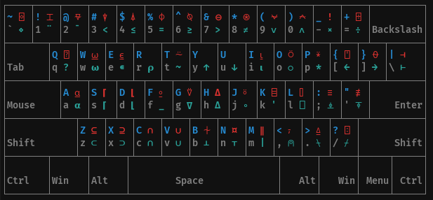
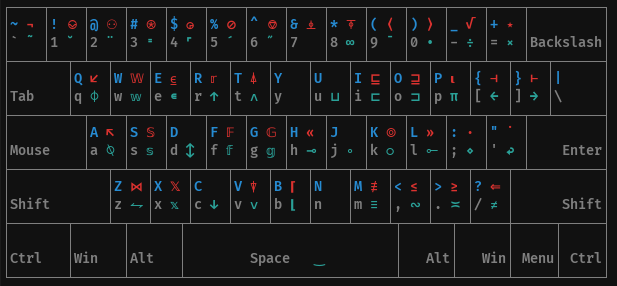

Keymap Tools
============

The original for these tools is the need to enter commands for the APL and BQN
languages on the console.  With the compose capabilities of the X11 server (and
Xwayland) one can easily define additional keymaps.  The authors of the interpreters
for these languages thoughtfully provide those.

The included XCompose file is a combined version of the files for APL and BQN which
can be found on the net:

- [APL compose map](https://gist.github.com/rikedyp/d5ef5a61b01b9d4227f358ea9dce5070)
- [BQN compose map](https://github.com/mlochbaum/BQN/blob/master/editors/XCompose)

Also included are a few mappings which I personally found useful over time.

Aside the merged XCompose file the package provides a script which can show the mapping
of the characters to the keys.  The script uses colors, if used on a terminal, to
indicate how the characters can be reached:

- gray: normal
- blue: shifted key
- cyan: composed with language prefix and key
- red: composed with language prefix and shifted key

The language prefix, as used in the distributed XCompose file, is the grave for APL and
the backslash for BQN.  The script supports other arbitrary prefixes using the `-s` option.

Use the `-h` option to see the details of the script parameters.

Example: to enter 𝕨 from the BQN keymap use `compose \ w`.

Example 2: to enter ⎕ from the APL keymap use `compose &#96; l`

## Screenshots:

The APL keymap as defined in the XCompose file:

The BQN keymap:

